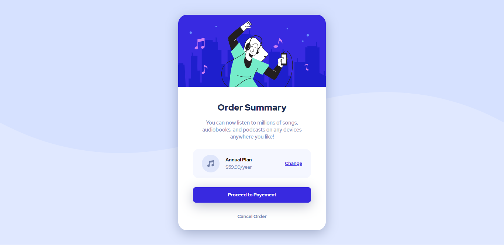

# Frontend Mentor - Order summary card solution

This is a solution to the [Order summary card challenge on Frontend Mentor](https://www.frontendmentor.io/challenges/order-summary-component-QlPmajDUj). Frontend Mentor challenges help you improve your coding skills by building realistic projects. 

## Table of contents

- [Overview](#overview)
  - [The challenge](#the-challenge)
  - [Screenshot](#screenshot)
  - [Links](#links)
- [My process](#my-process)
  - [Built with](#built-with)
  - [Useful resources](#useful-resources)
- [Author](#author)

## Overview
Challenge completed using HTML5,CSS,Javascript

### The challenge

Users should be able to:

- View the optimal layout for the site depending on their device's screen size
- See hover states for all interactive elements on the page

### Screenshot

* Desktop version (width : 1440px)

* Mobile version (width : 375px)

### Links

- Solution URL: [Add solution URL here](https://your-solution-url.com)
- Live Site URL: [Add live site URL here](https://your-live-site-url.com)

## My process

### Built with

- HTML5 
- CSS 3
- Flexbox

### Useful resources

- [google fonts](https://fonts.google.com/specimen/Red+Hat+Display) - The font used is "Red Hat Display" with the fonts 500,700,900. 

## Author

- Frontend Mentor - [@abdelghafourbarane](https://www.frontendmentor.io/profile/abdelghafourbarane)
- Linkedin - [@Abdelghafour Barane](https://www.linkedin.com/in/abdelghafour-barane-54a443148/)
- Gmail - [@barane abdelghafour](baraneabdelghafour@gmail.com)

